# RNASeq Analysis - Reads Visualization and Quantification
**Shells:** Shell <br>
**Softwares / packages:** sratoolkit, FastQC, MultiQC, Trimmomatic, fastp, HISAT2, Samtools, featureCounts <br>
**Data:**  Himes, Blanca E., et al. "RNA-Seq transcriptome profiling identifies CRISPLD2 as a glucocorticoid responsive
 gene that modulates cytokine function in airway smooth muscle cells." PloS one 9.6 (2014): e99625.
## SRA files acquisition
A SRR_Acc_list.txt file was downloaded from SRA Run Selector. Sratoolkit was used to download .sra files. <br>

```<Shell>
mkdir ../sraData
/home/user/projects/Bioinfo/Tools/sratoolkit.3.0.0-centos_linux64/bin/prefetch --option-file ../SRR_Acc_List.txt -p -O /home/user/projects/Bioinfo/RNASeq/20220623/sraData &
```

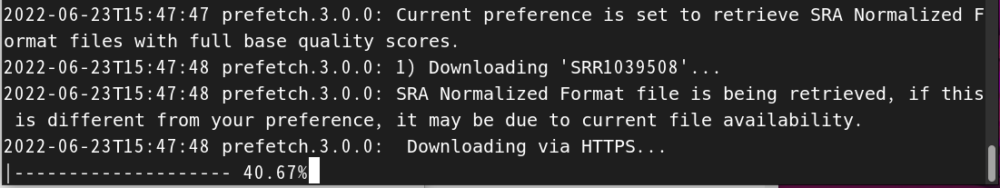

## Conversion of SRA files to fastq files

```<Shell>
mkdir ../fastq
for i in ../sraData/*.sra
do
echo $i
/home/user/projects/Bioinfo/Tools/sratoolkit.3.0.0-centos_linux64/bin/fastq-dump --split-3 --gzip ../sraData/$i -O ../fastq
done
```
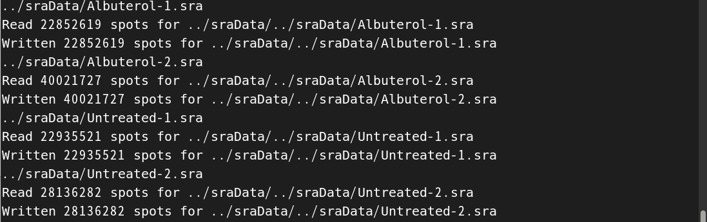 <br>
<br>fastq.gz files can be unzipped and checked out in gedit.  <br><br>
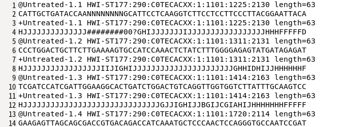
## QC on fastq files
FastQC was used to check the quality of fastq data. <br>
MultiQC was used to generate a [merged QC report](./20220623/fastqc/multiqc_report.html). <br>
Data quality was good enough for analysis. <br>
```<Shell>
mkdir ../fastqc
mkdir ../logs/fastqc
fastqc --outdir ../fastqc --threads 8 ../fastq/*.fastq.gz > ../logs/fastqc/log.txt 2>&1
multiqc ../fastqc/*.zip -o ../fastqc
```
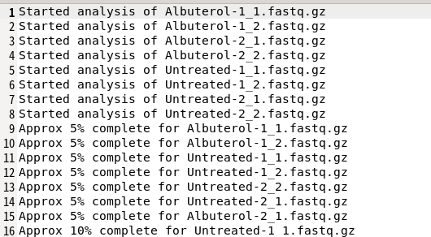<br>


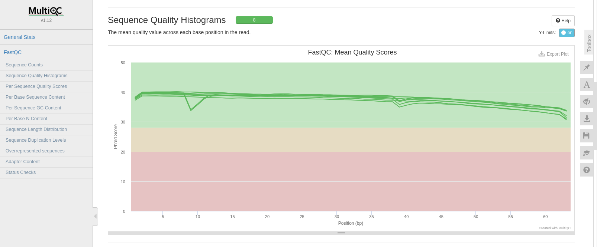<br>
## Reads filtering
When processing data of low quality, sequnecing reads could be trimmed and filtered by Trimmomatic. <br>
MultiQC was used to generate a [merged QC report](./20220623/fastqc/multiqc_report.html). <br>
```<Shell>
mkdir ../fastqTrim
mkdir ../logs/trimmomatic
cd ../fastqTrim
trimmomatic PE \
../fastq/Albuterol-1_1.fastq.gz ../fastq/Albuterol-1_2.fastq.gz \
-baseout trimAlbuterol-1.fastq.gz \
-trimlog ../logs/trimmomatic/trimmomatic-Albuterol-1.log \
ILLUMINACLIP:/home/user/anaconda3/pkgs/trimmomatic-0.39-hdfd78af_2/share/trimmomatic/adapters/TruSeq3-PE.fa:2:30:10 \
LEADING:3 TRAILING:3 SLIDINGWINDOW:4:20 MINLEN:36

mkdir fastqc
mkdir ../logs/fastqTrimFastqc
fastqc --outdir ./fastqc --threads 8 ./*.fastq.gz > ../logs/fastqTrimFastqc/log.txt 2>&1
multiqc ./fastqc/*.zip -o ./fastqc
```
<br>
Alternatively, fastp could be used to process and filter fastq files. [Fastp reports](./20220623/fastp/fastpAlbuterol-1.html) were generated individually.  <br>
```<Shell>
mkdir ../fastp
mkdir ../logs/fastp
cd ../fastq
for i in Albuterol-1 Albuterol-2 Untreated-1 Untreated-2
do 
echo $i
../scripts/fastp -i ${i}_1.fastq.gz -I ${i}_2.fastq.gz \
 -o ../fastp/fastp${i}_1.fastq.gz -O ../fastp/fastp${i}_2.fastq.gz \
--html ../fastp/fastp$i.html \
--json ../fastp/fastp$i.json \
--cut_front \
--cut_right \
--cut_window_size 4 \
--cut_mean_quality 20 \
--trim_poly_g \
--trim_poly_x \
--length_required 36 > ../logs/fastp/fastp$i.txt 2>&1 
done
```
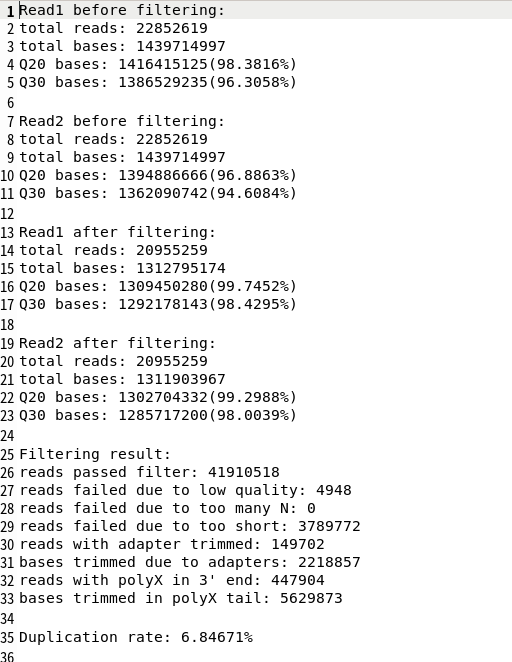
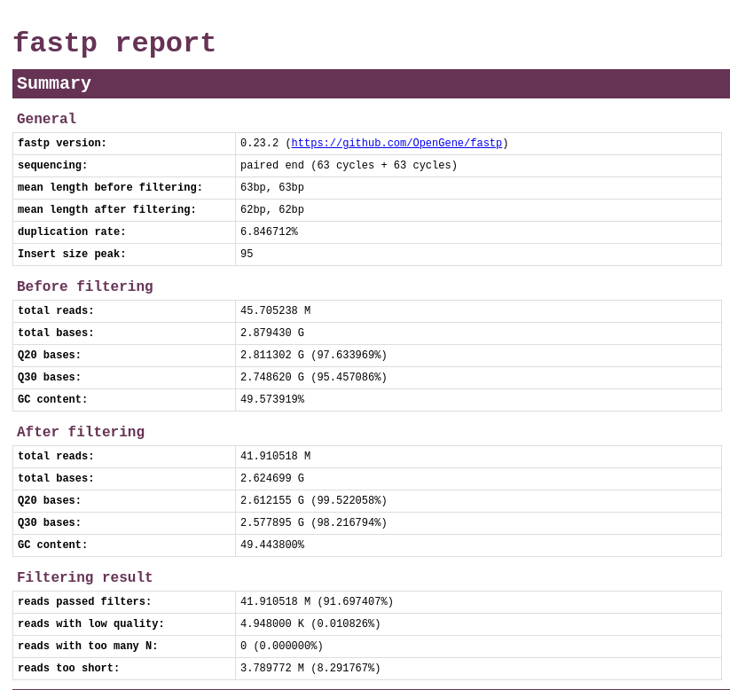
## Mapping reads to human genome 
RNASeq reads was mapped to human genome using HISAT2, generating .sam files. <br>
```<Shell>
mkdir -p ../aligned/fromFastp
mkdir ../logs/hisat2
cd ../fastp
for i in Albuterol-1 Albuterol-2 Untreated-1 Untreated-2
do
hisat2 -t -x \
/home/user/projects/Bioinfo/Data/RefSeq/Human/GRCh38/Index/grch38_tran/genome_tran \
-1 fastp${i}_1.fastq.gz \
-2 fastp${i}_2.fastq.gz \
-S ../aligned/fromFastp/alignedFastp${i}.sam 2>&1 | tee ../logs/hisat2/alignedFastp${i}.txt
done
```
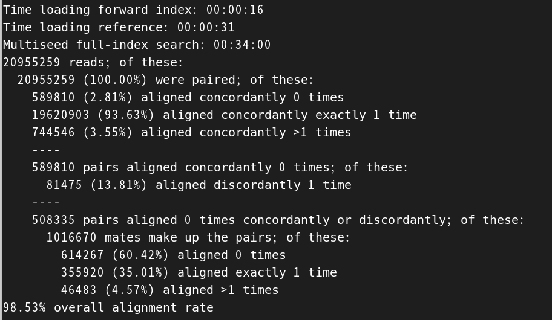<br>
## Data visualization in IGV
Conversion of .sam to .bam files. Sorting and indexing .bam files by Samtools. <br>
.bam adn corresponding .bai files could be loaded in IGV. <br>
```<Shell>
samtools view alignedFastpUntreated-2.sam -b > alignedFastpUntreated-2.bam
samtools sort --threads 4 alignedFastpUntreated-2.bam -o alignedFastpUntreated-2_sorted.bam
samtools index alignedFastpUntreated-2_sorted.bam
```
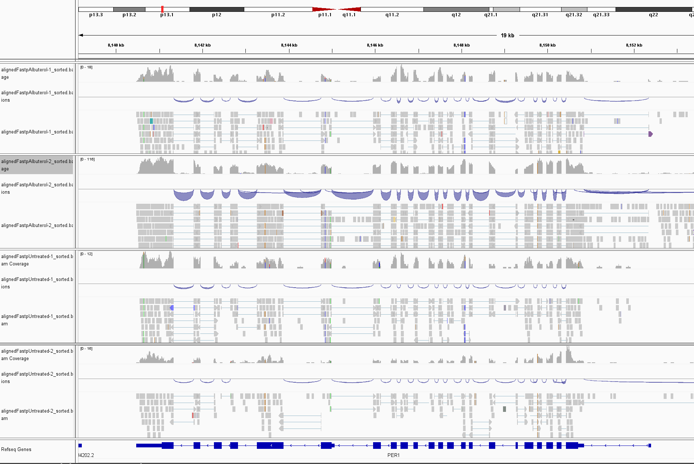 <br>
## Quantification
featureCounts was used for counting reads by genomic features. Results could be [summaried](./20220623/fastp/multiqc_report.html) by MultiQC. <br>
```<Shell>
featureCounts -p -T 4 -t gene -g gene_id \
-a /home/user/projects/Bioinfo/Data/RefSeq/Human/GRCh38/gencode.v32.annotation.gtf \
-o readCount.txt \
alignedFastpAlbuterol-1_sorted.bam alignedFastpAlbuterol-2_sorted.bam \
alignedFastpUntreated-1_sorted.bam alignedFastpUntreated-2_sorted.bam \
> ../../logs/featureCounts/log.txt 2>&1
multiqc readCount.txt.summary
```
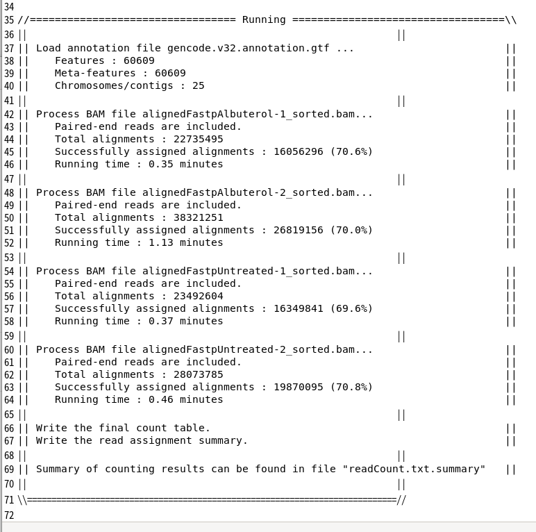<br>
featureCounts generated a tab-delimited readCount.txt file which can be further analyzed. <br><br>
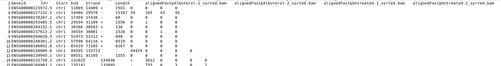<br>


