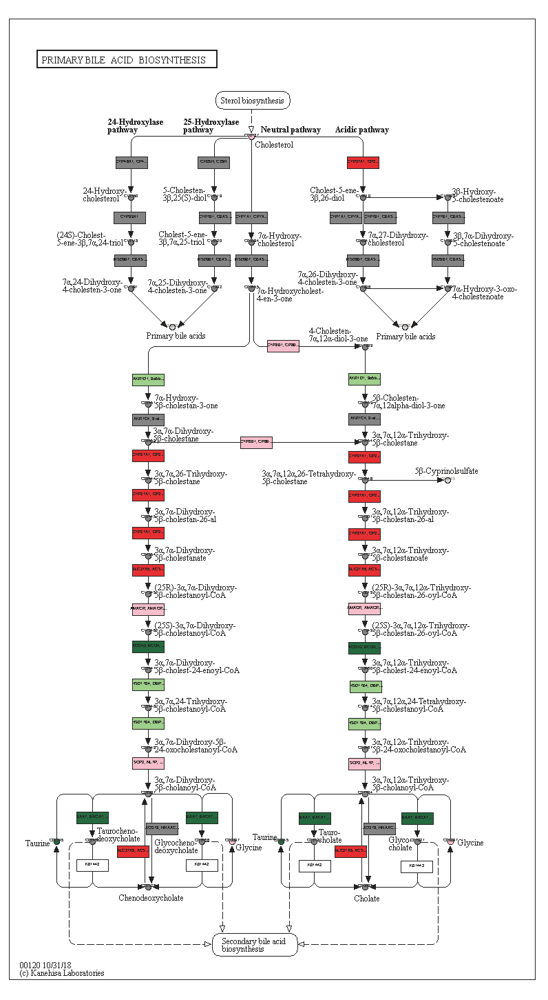
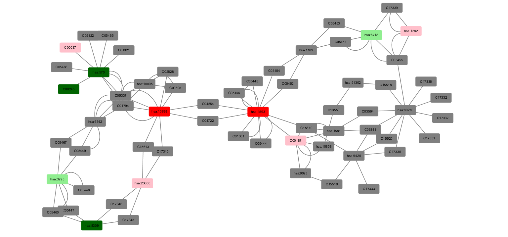

# Tools - Cytoscape
**Language:** Python <br>
**Softwares / packages:** KGMLCanvas, Cytoscape <br>
ChBE194 Data Science in Biotechnology (2019 spring) Problem Set 4. <br>
Write a function that produces a KGML canvas image of a pathway with compounds and genes color coded based on significance.<br>
- Light green - down regulated, not significant
- Dark Green ¨C down regulated, significant
- Pink ¨C upregulated, not significant
- Red ¨C upregulated, significant<br>

As an example output, show the figure for bile acid synthesis color-coded based on statistically significant proteins and metabolites from the rodent RYGB vs. SHAM dataset. <br>
Write a function that produces a cytoscape network and attributes file for a KEGG pathway with nodes color coded based on significance from the same rodent RYGB datset. Produce a network image for the bile acid synthesis pathway.<br>


```<Python>
# Only part of the code is presented here

# Function to generate a map with highlighted color

def Pset4_1_fun(mapstr):
    pathway = KGML_parser.read(kegg_get(mapstr, "kgml"))
    element_genes = pathway.genes
    element_comps = pathway.compounds
    
    for i in range(len(element_genes)):
        element_name = element_genes[i].graphics[0].name
        element_name = element_name.split(',')[0].strip()
        element_name = str(element_name).upper()
        if element_name in FCpv_genes:
            if FCpv_genes[element_name]['FC'] > 0 and FCpv_genes[element_name]['p_value'] < 0.05:
                pathway.genes[i].graphics[0].bgcolor = '#FF0000'
            elif FCpv_genes[element_name]['FC'] > 0 and FCpv_genes[element_name]['p_value'] > 0.05:
                pathway.genes[i].graphics[0].bgcolor = '#FFC0CB'
            elif FCpv_genes[element_name]['FC'] < 0 and FCpv_genes[element_name]['p_value'] < 0.05:
                pathway.genes[i].graphics[0].bgcolor = '#006400'
            elif FCpv_genes[element_name]['FC'] < 0 and FCpv_genes[element_name]['p_value'] > 0.05:
                pathway.genes[i].graphics[0].bgcolor = '#90EE90'
        else:
            pathway.genes[i].graphics[0].bgcolor = '#808080'
        
    for i in range(len(element_comps)):
        element_name = element_comps[i].graphics[0].name
        
        if element_name in FCpv_comp:
            if FCpv_comp[element_name]['FC'] > 0 and FCpv_comp[element_name]['p_value'] < 0.05:
                pathway.compounds[i].graphics[0].bgcolor = '#FF0000'
            elif FCpv_comp[element_name]['FC'] > 0 and FCpv_comp[element_name]['p_value'] > 0.05:
                pathway.compounds[i].graphics[0].bgcolor = '#FFC0CB'
            elif FCpv_comp[element_name]['FC'] < 0 and FCpv_comp[element_name]['p_value'] < 0.05:
                pathway.compounds[i].graphics[0].bgcolor = '#006400'
            elif FCpv_comp[element_name]['FC'] < 0 and FCpv_comp[element_name]['p_value'] > 0.05:
                pathway.compounds[i].graphics[0].bgcolor = '#90EE90'
        else:
            pathway.compounds[i].graphics[0].bgcolor = '#808080'
    
    return(pathway)

new_BA_pathway = Pset4_1_fun('hsa00120')
canvas = KGMLCanvas(new_BA_pathway, import_imagemap = True)
canvas.draw("output.pdf")

# Generate node and edge list for cytoscape
# Can be imported to make a network image

BA_node_list = []
BA_node_list.append(node_lines[0])
for idx,node in enumerate(node_lines):
    curr_node = node.split('\t')
    
    if curr_node[0].strip() in BA_nodes:
        if curr_node[1] == 'protein':
            for key,value in FCpv_genes.items():
                if curr_node[0].strip() == value['Hsa id'][0]:  
            
                    if value['FC'] > 0 and value['p_value'] < 0.05:
                        bgcolor = '#FF0000'
                    elif value['FC'] > 0 and value['p_value'] > 0.05:
                        bgcolor = '#FFC0CB'
                    elif value['FC'] < 0 and value['p_value'] < 0.05:
                        bgcolor = '#006400'
                    elif value['FC'] < 0 and value['p_value'] > 0.05:
                        bgcolor = '#90EE90'
                    break 
                else:
                    bgcolor = '#808080'
                    
        elif curr_node[1] == 'cpd':
            if curr_node[0] in FCpv_comp:
                if FCpv_comp[curr_node[0]]['FC'] > 0 and FCpv_comp[curr_node[0]]['p_value'] < 0.05:
                    bgcolor = '#FF0000'
                elif FCpv_comp[curr_node[0]]['FC'] > 0 and FCpv_comp[curr_node[0]]['p_value'] > 0.05:
                    bgcolor = '#FFC0CB'
                elif FCpv_comp[curr_node[0]]['FC'] < 0 and FCpv_comp[curr_node[0]]['p_value'] < 0.05:
                    bgcolor = '#006400'
                elif FCpv_comp[curr_node[0]]['FC'] < 0 and FCpv_comp[curr_node[0]]['p_value'] > 0.05:
                    bgcolor = '#90EE90'
            else:
                bgcolor = '#808080'
            
        curr_node[3] = bgcolor
        tab = '\t'
        node_new = tab.join(curr_node)
        BA_node_list.append(node_new)
```
